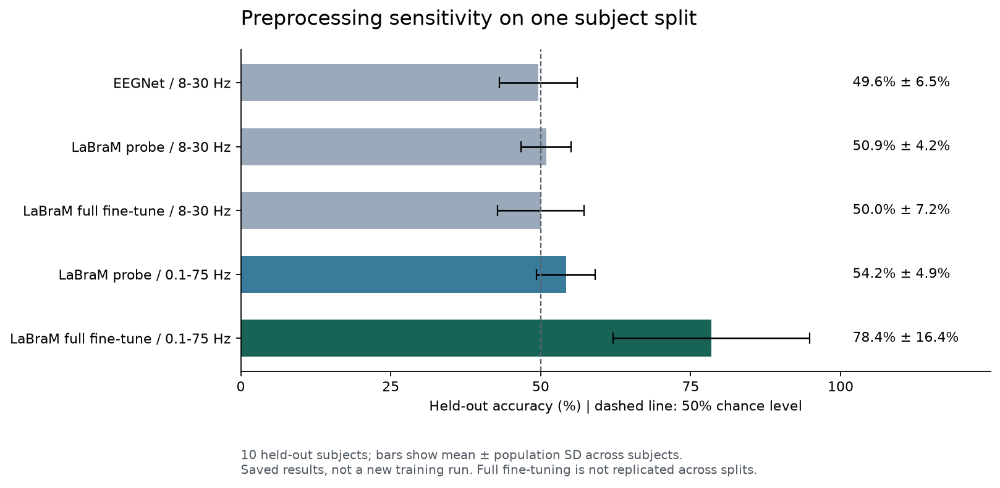

# Cross-Subject EEG Motor-Imagery Decoding

This project asks a harder question than within-subject classification: **can a model decode left- vs. right-hand motor imagery for people it never saw during training?**

Using PhysioNet EEG Motor Movement/Imagery data, I built subject-disjoint experiments comparing EEGNet with the pretrained LaBraM foundation model. The main lesson was not simply that a larger model performed better—it was that matching a pretrained model's original input distribution changed the experimental conclusion.

> 中文研究记录：[README.zh-CN.md](README.zh-CN.md)  
> Full matched-comparison notes: [FINDINGS_labram_vs_eegnet.md](FINDINGS_labram_vs_eegnet.md)

## Inspect the result in one minute

```bash
python3 scripts/summarize_results.py
```

This command uses only Python's standard library, reads the committed JSON files, and recomputes the broadband summaries from the ten per-subject results. It does not download data, install PyTorch, or train a model.



## Results at a glance

The matched comparison used separate training data, a **5-subject validation cohort**, and a **10-subject held-out test cohort**.

| Model and protocol | Held-out result |
|---|---:|
| EEGNet, 8–30 Hz | 49.6% ± 6.5% |
| LaBraM linear probe, 8–30 Hz | 50.9% ± 4.2% |
| LaBraM full fine-tune, 8–30 Hz | 50.0% ± 7.2% |
| LaBraM linear probe, 0.1–75 Hz | 54.2% ± 4.9% |
| **LaBraM full fine-tune, 0.1–75 Hz** | **78.4% ± 16.4%, kappa +0.58** |

The independent validation cohort reached approximately **72%** under the successful broadband setup. Eight of ten held-out test subjects scored between 67% and 100%, while two remained near chance.

## Important limitation

The 78.4% result comes from **one subject split**. The ±16.4% is variation across the ten held-out subjects, not confirmation across multiple random subject splits. Broadband EEGNet was not run on this same split, so the table does not isolate a pretraining advantage over a matched broadband baseline. Full multi-seed replication was not completed because of compute limits, and training accuracy reached 99.5%, so overfitting remains a real concern.

I report the result as strong evidence worth replicating—not as a final benchmark.

## What changed the outcome

With the conventional 8–30 Hz motor-imagery band, every method remained near chance. LaBraM was pretrained on broadband EEG; the change is consistent with sensitivity to its input distribution, though the incomplete same-split baseline limits causal conclusions. Restoring 0.1–75 Hz input while keeping the comparison subject-disjoint produced the large gain.

This creates a general evaluation lesson: **when transferring a pretrained model, preprocessing is part of the model contract.** A reasonable domain convention can still produce the wrong conclusion if it breaks that contract.

## Experimental design

- Dataset: PhysioNet EEG Motor Movement/Imagery
- Task: imagined left vs. right hand movement
- Inputs: 64 EEG channels, runs 4/8/12
- Split policy: subject-disjoint training, validation, and test cohorts
- Models: EEGNet and LaBraM
- LaBraM modes: frozen linear probe and full fine-tuning
- Reporting: held-out subject accuracy, variation across subjects, Cohen's kappa, validation behavior, and explicit caveats

## Technical adaptations

- Converted signal scale to microvolts to match LaBraM's expected input convention.
- Interpolated/mapped EEG channels to the pretrained model's channel representation.
- Adapted temporal embeddings for the experiment's 1,000-sample windows.
- Kept subject identities disjoint to prevent person-level leakage.

## Results and source map

| Artifact | What it contains |
| --- | --- |
| [step3_results.json](step3_results.json) | Split A: narrowband summaries, subject IDs, configuration, and per-subject values |
| [step3b_broadband_results.json](step3b_broadband_results.json) | Split A: broadband LaBraM per-subject accuracy and kappa |
| [step3c_fullmatrix_results.json](step3c_fullmatrix_results.json) | Partial follow-up matrix; do not treat it as completed replication |
| [step3_compare.py](step3_compare.py) | Narrowband experiment |
| [step3b_broadband.py](step3b_broadband.py) | Broadband LaBraM experiment |
| [FINDINGS_labram_vs_eegnet.md](FINDINGS_labram_vs_eegnet.md) | Historical investigation notes and remaining comparisons |

These files live at the repository root, not in a `results/` directory. The historical notes include exploratory interpretations; the limitations above govern the strength of the headline result.

## Training prerequisites

The historical notes record Python 3.12, PyTorch 2.12 with MPS, and Braindecode 1.5.1. The training scripts also import NumPy, MNE, and scikit-learn. A complete original environment lock is not available, so a fresh training environment still needs compatibility validation, including `braindecode.models.InterpolatedLaBraM`.

The scripts retrieve PhysioNet EEGBCI data through MNE and the `braindecode/labram-pretrained` weights through Braindecode. Training therefore needs network access, model/data storage, and substantially more compute than inspecting saved results. Existing scripts select MPS on supported Macs and CPU otherwise; they do not automatically select CUDA.

Before training, review the script's data selection, cache paths, and output path. Several historical scripts write to `~/bci-project/`; they are retained as experiment records rather than presented as a portable one-command training pipeline. Avoid overwriting the committed result files with a new run.

## Regenerate the figure

```bash
python3 -m pip install matplotlib
python3 scripts/plot_results.py
```

The figure uses the same saved split-A artifacts as the summary command. Error bars show population standard deviation across subjects, not confidence intervals or variance across random splits.
